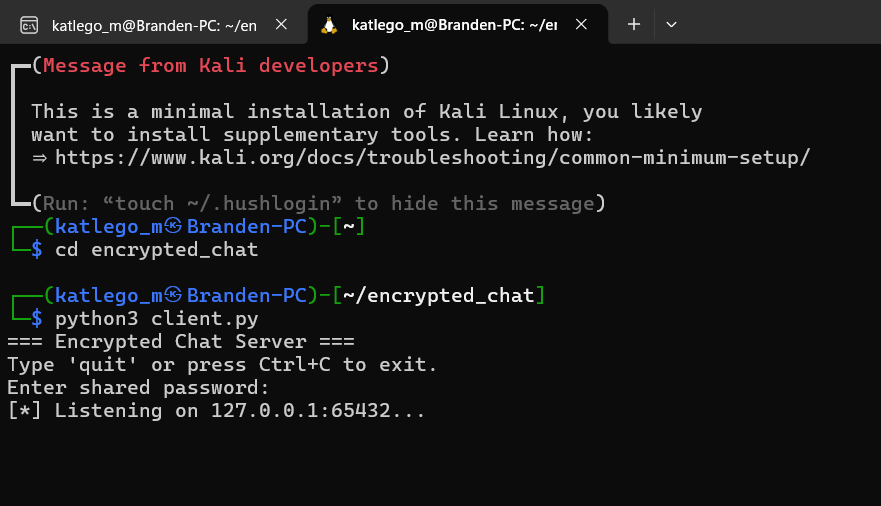
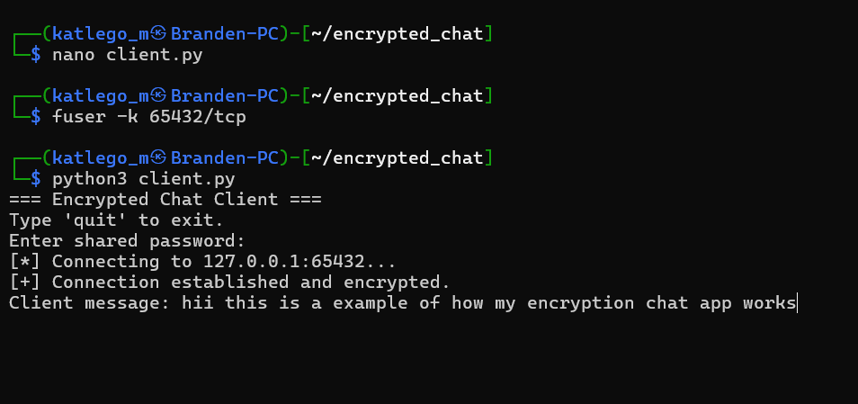
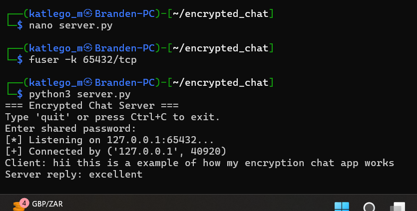

<!DOCTYPE html>
<html>
<head>
    <meta charset="UTF-8">
    <title>Encrypted Chat Prototype</title>
</head>
<body>

<h1>Encrypted Chat Prototype</h1>

This project is a Python-based encrypted client-server chat prototype designed
for educational purposes in cybersecurity. It demonstrates how secure key
derivation and encryption are applied in real-world communication systems.

<h2>Project Objectives</h2>
<ul>
    <li>Demonstrate PBKDF2 key derivation using a password and salt</li>
    <li>Encrypt messages using Fernet (AES-based symmetric encryption)</li>
    <li>Prevent plaintext data exposure over the network</li>
    <li>Teach secure communication principles to cybersecurity interns</li>
</ul>

<h2>Technologies Used</h2>
<ul>
    <li>Python 3</li>
    <li>Kali Linux</li>
    <li>cryptography library</li>
    <li>Socket programming</li>
</ul>

<h2>Project Structure</h2>
<pre>
encrypted_chat/
├── server.py
├── client.py
├── screenshots/
│   ├── server_running.png
│   ├── client_running.png
│   └── encrypted_chat.png
└── README.md
</pre>

<h2>How the System Works</h2>
<ol>
    <li>The server starts and waits for client connections</li>
    <li>A cryptographic salt is generated and sent to the client</li>
    <li>Both sides derive the same encryption key using PBKDF2</li>
    <li>Messages are encrypted before transmission</li>
    <li>Messages are decrypted upon receipt</li>
</ol>

<h2>Running the Project</h2>

<h3>Start the Server</h3>
<pre>
python3 server.py
</pre>

<h3>Start the Client</h3>
<pre>
python3 client.py
</pre>

Both the client and server must use the same password to derive the same
encryption key.

<h2>Screenshots</h2>

<h3>Server Running</h3>

<h3>Client Running</h3>

<h3>Encrypted Communication</h3>

<h2>Security Concepts Demonstrated</h2>
<ul>
    <li>Password-Based Key Derivation (PBKDF2)</li>
    <li>Salting to prevent rainbow table attacks</li>
    <li>Symmetric encryption using Fernet</li>
    <li>Secure client-server communication</li>
</ul>

<h2>Author</h2>

<b>Katlego Motsoaledi</b> 
Cybersecurity Intern 
Python & Security Enthusiast

</body>
</html>
